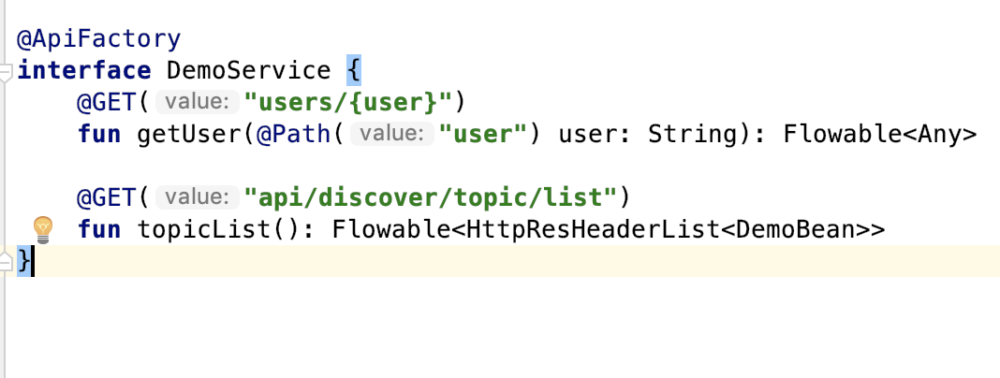
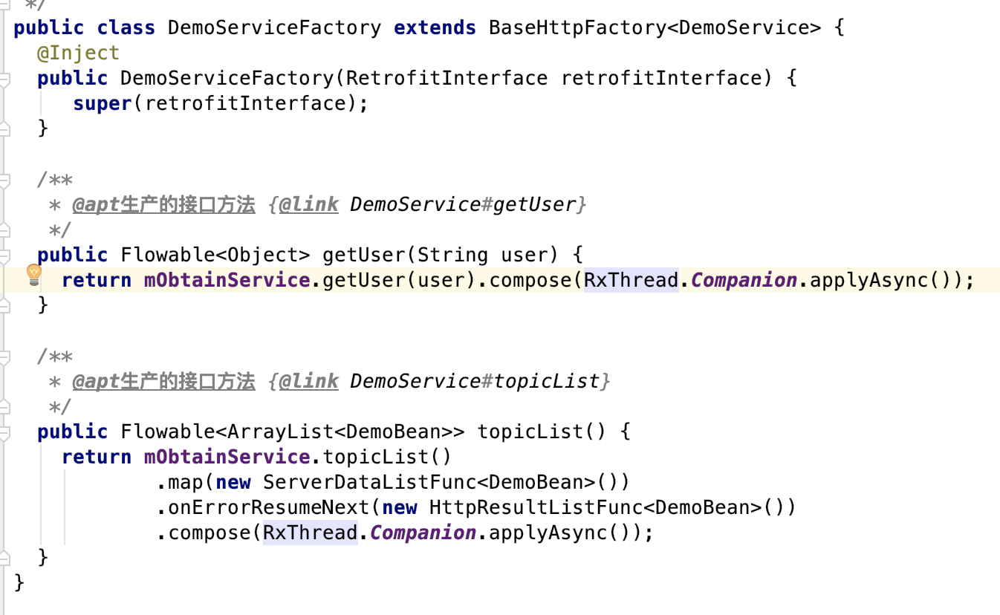
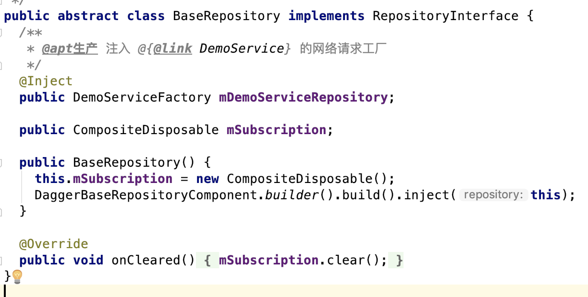
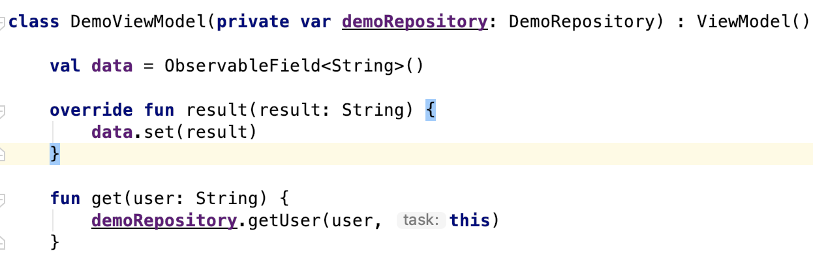
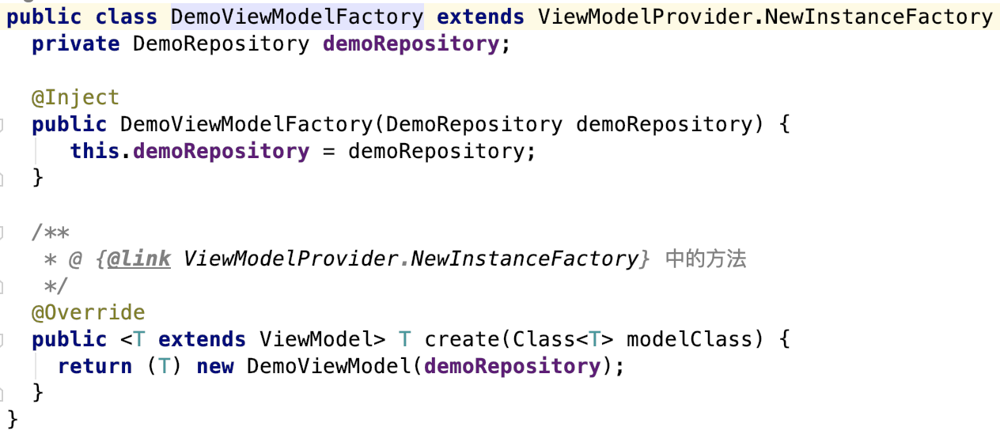
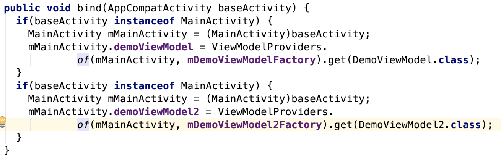
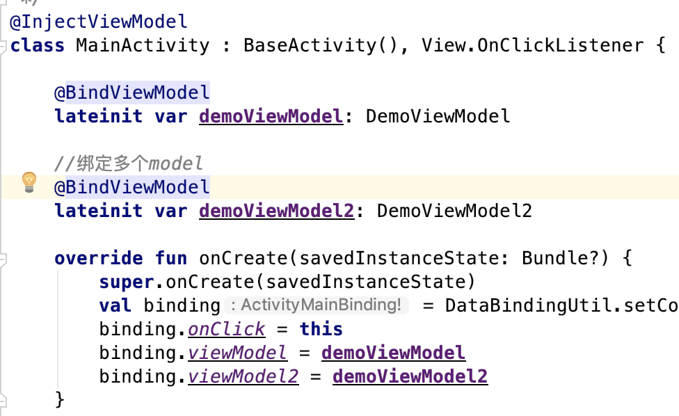
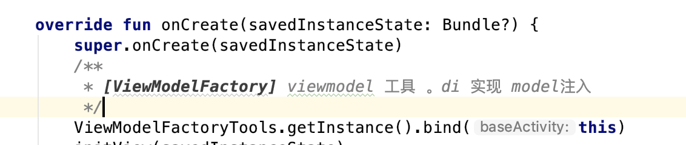
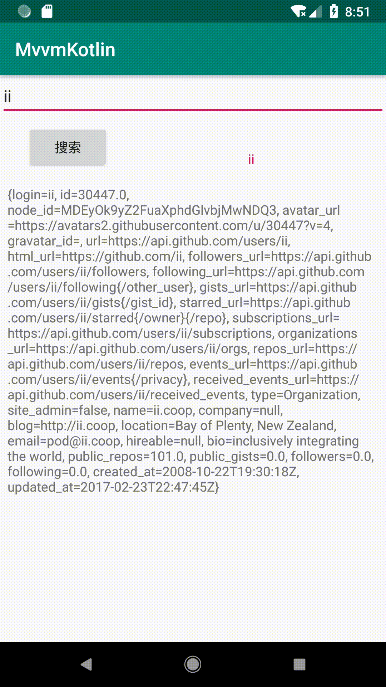

# MvvmKotlin

     只使用3个注解也可以轻松完成Mvvm框架的搭建，本项目根据Google 新框架jetpack配合dagger2 、Apt构建完成。

     项目整体架构参照Google的模式，基本保持一致。

     如图：
 

Respository (数据层)
-----------------
    Respository(数据处理层): 是用来处理网络数据、数据库、本地等数据的逻辑。

    自定义Repository只需继承BaseRepository (BaseRepository 由APT自动生成，并且提供所有网络(Retrofit)接口实例) 可以轻松获取各个接口数据。

- 处理retrofit接口 添加注解ApiFactory即可，内涵大量关联类的注释。

- APT自动生成retrofit接口工厂，处理请求数据。

- APT自动生成BaseRepository,通过dagger注入所有接口工厂,拥有所有retrofit接口工厂实例。

ViewModel (Model层)
------------------
    ViewModel模块无须关心Factory的生产过程。只需在构造函数中 传入需要的Respository(数据层）,可同时传入多个数据源。

    Factory将自动获取数据实例传入ViewModel中。
- ViewModel构造传入数据源获取数据

- APT自动生成对应的ViewModelFactory,并将model需要的数据源传入

Activity/Fragment (View层)
-------------------------
    配合APT自动完成ViewModel 与Respository 的注入过程, 类似ButterKnife 利用控制反转轻松实现Activity/Fragment与ViewModel的关联。
    View可支持多个ViewModel的注入。
    
- APT自动生成ViewModelFactory Tools,bind用于View与ViewModel的绑定。View中绑定ViewModel的个数取决于View中bindViewModel的个数
    

- 在View基类中获取ViewModelFactoryTools的实例,用于绑定View与ViewModel,并且给View中带有 @BindViewModel注解的 ViewModel赋值。

Thanks
--------------
Google官方Jetpack框架 [android-sunflower][https://github.com/googlesamples/android-sunflower]

感谢 [T-MVP][https://github.com/north2016/T-MVP] 提供学习参考

Libraries Used
--------------
* [Foundation][0] - Components for core system capabilities, Kotlin extensions and support for
  multidex and automated testing.
  * [AppCompat][1] - Degrade gracefully on older versions of Android.
  * [Android KTX][2] - Write more concise, idiomatic Kotlin code.
  * [Test][4] - An Android testing framework for unit and runtime UI tests.
* [Architecture][10] - A collection of libraries that help you design robust, testable, and
  maintainable apps. Start with classes for managing your UI component lifecycle and handling data
  persistence.
  * [Data Binding][11] - Declaratively bind observable data to UI elements.
  * [Lifecycles][12] - Create a UI that automatically responds to lifecycle events.
  * [LiveData][13] - Build data objects that notify views when the underlying database changes.
  * [Navigation][14] - Handle everything needed for in-app navigation.
  * [Room][16] - Access your app's SQLite database with in-app objects and compile-time checks.
  * [ViewModel][17] - Store UI-related data that isn't destroyed on app rotations. Easily schedule
     asynchronous tasks for optimal execution.
  * [WorkManager][18] - Manage your Android background jobs.
* [UI][30] - Details on why and how to use UI Components in your apps - together or separate
  * [Animations & Transitions][31] - Move widgets and transition between screens.
  * [Fragment][34] - A basic unit of composable UI.
  * [Layout][35] - Lay out widgets using different algorithms.
* Third party
  * [Glide][90] for image loading
  * [Kotlin Coroutines][91] for managing background threads with simplified code and reducing needs for callbacks

[0]: https://developer.android.com/jetpack/foundation/
[1]: https://developer.android.com/topic/libraries/support-library/packages#v7-appcompat
[2]: https://developer.android.com/kotlin/ktx
[4]: https://developer.android.com/training/testing/
[10]: https://developer.android.com/jetpack/arch/
[11]: https://developer.android.com/topic/libraries/data-binding/
[12]: https://developer.android.com/topic/libraries/architecture/lifecycle
[13]: https://developer.android.com/topic/libraries/architecture/livedata
[14]: https://developer.android.com/topic/libraries/architecture/navigation/
[16]: https://developer.android.com/topic/libraries/architecture/room
[17]: https://developer.android.com/topic/libraries/architecture/viewmodel
[18]: https://developer.android.com/topic/libraries/architecture/workmanager
[30]: https://developer.android.com/jetpack/ui/
[31]: https://developer.android.com/training/animation/
[34]: https://developer.android.com/guide/components/fragments
[35]: https://developer.android.com/guide/topics/ui/declaring-layout
[90]: https://bumptech.github.io/glide/
[91]: https://kotlinlang.org/docs/reference/coroutines-overview.html

License
-------

Copyright 2018 Google, Inc.

Licensed to the Apache Software Foundation (ASF) under one or more contributor
license agreements.  See the NOTICE file distributed with this work for
additional information regarding copyright ownership.  The ASF licenses this
file to you under the Apache License, Version 2.0 (the "License"); you may not
use this file except in compliance with the License.  You may obtain a copy of
the License at

  http://www.apache.org/licenses/LICENSE-2.0

Unless required by applicable law or agreed to in writing, software
distributed under the License is distributed on an "AS IS" BASIS, WITHOUT
WARRANTIES OR CONDITIONS OF ANY KIND, either express or implied.  See the
License for the specific language governing permissions and limitations under
the License.

